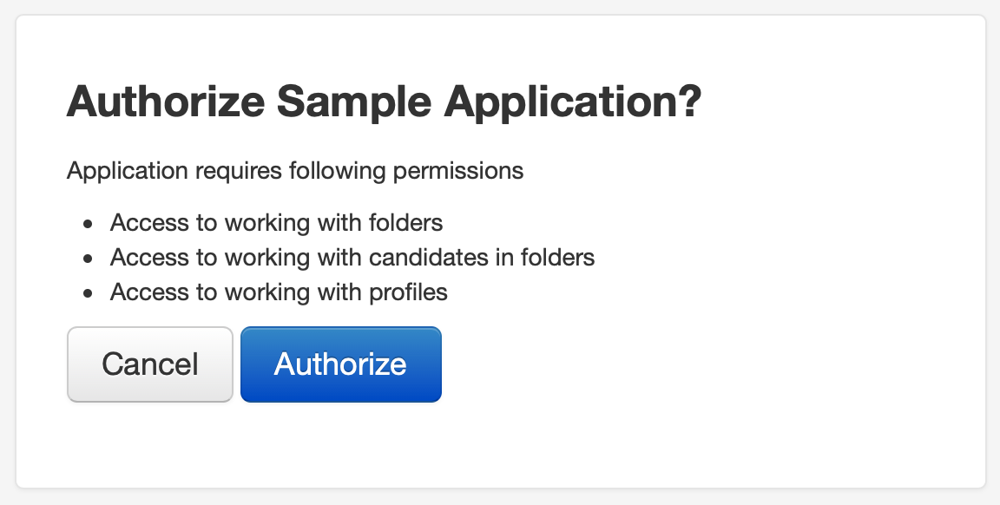

# oAuth 2.0 Authorization

[RFC 6749](https://tools.ietf.org/html/rfc6749)

## Urls

| Type                              | Url                                              |
|-----------------------------------|--------------------------------------------------|
| Authorization                     | https://search.amazinghiring.com/o/authorize/    |
| Get or refresh token              | https://search.amazinghiring.com/o/token/        |
| Revoke token                      | https://search.amazinghiring.com/o/revoke_token/ |

## Requesting authorization

To request authorization you have to redirect user to application authorization page.

For example:
```
https://search.amazinghiring.com/o/authorize?state=random_state_string&client_id=${CLIENT_ID}&response_type=code
```

`${CLIENT_ID}` - your application client id

User will be asked to authorize your application:



After authorization user will be redirected to your application redirect url:

```
https://sample.acme.com/redirect_url?state=random_state_string&code=${CODE}
```

`${CODE}` - The temporary authorization token provided by AmazingHiring

## Getting access token

```
POST https://search.amazinghiring.com/o/token/
```

with form-encoded data:

```
code: ${CODE}
redirect_uri: https://sample.acme.com/redirect_url
grant_type: authorization_code
```

```
curl 'https://search.amazinghiring.com/o/token/' -H 'Accept: */*' --data 'code=${CODE}&redirect_uri=https%3A%2F%2Fsample.acme.com%2Fredirect_url&grant_type=authorization_code'
```

If everything is ok, you'll get response with access and refresh tokens:

```
{
    "access_token": "ACCESS_TOKEN",
    "token_type": "Bearer",
    "expires_in": 36000,
    "refresh_token": "REFRESH_TOKEN",
    "scope": "folders candidates profiles"
}
```

## Refreshing access token
```
POST https://search.amazinghiring.com/o/token/
```

with form-encoded data:

```
refresh_token: ${REFRESH_TOKOEN}
grant_type: refresh_token
```

If everything is ok, you'll get response with new access and new refresh tokens:

```
{
    "access_token": "ACCESS_TOKEN",
    "token_type": "Bearer",
    "expires_in": 36000,
    "refresh_token": "REFRESH_TOKEN",
}
```


## Requesting API using oAuth2.0 access token

The token key should be included in the `Authorization` header.
The key should be prefixed by the string literal "Bearer", with whitespace separating the two strings. For example:

```
   Authorization: Bearer a0b1c2d3e4f5
```

## Revoke token 

To request revoke token you need to insert a refresh token the header

For example:
```
curl -X POST https://search.amazinghiring.com/o/revoke_token/ \
 -H 'Accept: */*' \
 --data 'token=<REFRESH_TOKEN>&redirect_uri=<REDIRECT_URI>&grant_type=authorization_code&client_id=<CLIENT_ID>&client_secret=<CLIENT_SECRET>'
```

[API v6 documentation](https://amazinghiring.github.io/api-v6-docs/)
